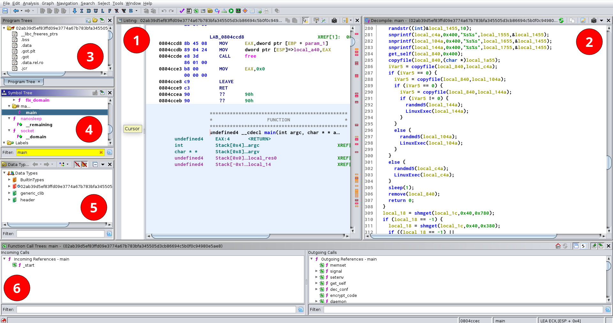
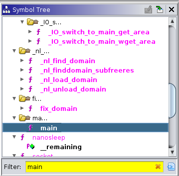
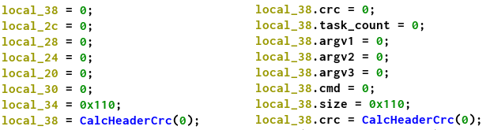
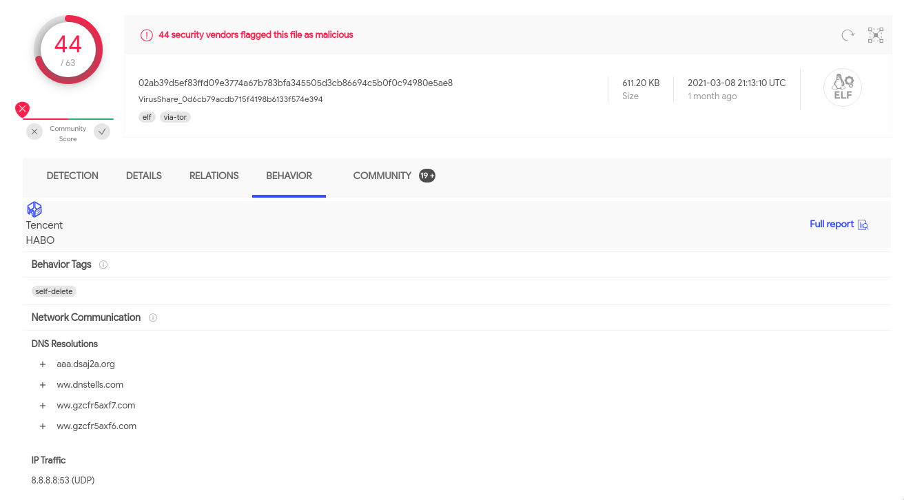

# Introduction

Malware is ubiquitous and security has become inseparable part of our lives. In
order to effectively protect ourselves from the threats, we need to understand
them. We need to know their internal workings. Most of the malware samples are
written for Windows platform, but we cannot neglect the Linux platform as the
potential damage can be devastating.

# Tools

In the first chapter, we will introduce some basic tools and concepts. This part
can serve as a brief introduction to the topic of reverse engineering in
general. We will also provide links for the tools that are commonly used for
each task. This chapter is partially based on the "Practical malware analysis"
[@sikorski2012practical].

Before we can start analysing potentially harmful code, we need to setup a
proper environment for the analysis. This typically means to create a virtual
machine that can be used for the analysis. Virtual machines provide a layer of
protection in case of an infection. Machine also typically contains all of the
tools used for the analysis. Popular choices are VirtualBox[^vbox],
VMware[^vmware] or libvirt[^libvirt].

[^vbox]: [https://www.virtualbox.org/](https://www.virtualbox.org/)
[^vmware]: [https://www.vmware.com/](https://www.vmware.com/)
[^libvirt]: [https://libvirt.org/](https://libvirt.org/)

Analysis can be divided into two main areas: *static analysis* and *dynamic
analysis*.

## Static analysis

*Static analysis* is a process of analyzation where the sample is not executed.
This is the safer option of the two. The core tools are *disassemblers* which
take the binary and disassemble it to the corresponding instructions that can be
further examined.

- PE explorer -> [http://www.pe-explorer.com/](http://www.pe-explorer.com/)
- PEiD -> [https://www.aldeid.com/wiki/PEiD](https://www.aldeid.com/wiki/PEiD)
- Strings
- Radare2/Rizin ->
    [https://rada.re/n/radare2.html](https://rada.re/n/radare2.html) or [https://rizin.re/](https://rizin.re/)
- BinaryNinja -> [https://binary.ninja/](https://binary.ninja/)

More advanced tools are *decompilers*. They take the disassembled output and try
to estimate the original source code. Since the compilation procedure is lossy,
the algorithms need to incorporate many heuristics that try to improve the
output quality.

- IDA PRO -> [https://www.hex-rays.com/products/ida/](https://www.hex-rays.com/products/ida/)
- Ghidra -> [https://ghidra-sre.org/](https://ghidra-sre.org/)
- Retdec -> [https://retdec.com/](https://retdec.com/)

## Dynamic analysis

Analogically to static analysis, *dynamic analysis* is a process of analyzation
where we are executing the code and tracing the execution. The core tools are
**debuggers** and **sandboxes**. They allow to either instrument the execution
of the sample or automatically execute it and provide detailed reports as to
what the sample actually did during the execution.

- GDB + strace/ltrace
- OlyDbg -> [http://www.ollydbg.de/](http://www.ollydbg.de/)
- Cuckoo -> [https://cuckoosandbox.org/](https://cuckoosandbox.org/)
- Angr -> [https://angr.io/](https://angr.io/)

## Packers

Packers are inseparable part of the malware analysis. Most of the samples are
packed using pre-made tools or custom encoding schemas. The goal of the packing
procedure is to hide the immediate information about the sample. Packed samples
are harder to analyse in the packed form.

- UPX -> [https://upx.github.io/](https://upx.github.io/)
- Movfuscator ->
    [https://github.com/xoreaxeaxeax/movfuscator](https://github.com/xoreaxeaxeax/movfuscator)
- Armadillo

# Case-study

In this section, we will analyse a sample from the internet. We provide a
example walk through all steps necessary to analyse how this malware operates.
In the end, we will reveal the name of the sample.

The sample is from this [Github
repository](https://github.com/greg5678/Malware-Samples), that states it
contains malware samples. Let's verify this claim and pick the first file

```
02ab39d5ef83ffd09e3774a67b783bfa345505d3cb86694c5b0f0c94980e5ae8
```

Simple and basic analysis can be done using `file` command.

```
ELF 32-bit LSB executable, Intel 80386, version 1 (SYSV), 
statically linked, for GNU/Linux 2.6.9, not stripped
```

From the output we can see that this file is a **32-bit executable file** in ELF
format. Furthermore, it is *statically linked* and symbols are present as it is
*not stripped*.

## Ghidra

For the analysis we will use Ghidra. Ghidra is a software reverse engineering
(SRE) suite of tools developed by NSA's Research Directorate in support of the
Cybersecurity mission[@ghidra]. The software is open-source and provides many of
the features available in the industry standard applications like IDA PRO.

Ghidra has concept of projects, which keep track of the analysis. They store
names of the variables, annotations, comments, and other user defined
information. Furthermore, it even supports shared projects that allows to
collaborate with multiple people. Creating a project is simple and we can import
samples using drag-and drop. Once the sample is assigned to the project, double
click it which will open a new Ghidra instance.

## User interface

Ghidra main user's interface consist of several parts, see Figure
\ref{img_ghidra}. Let's describe each part:



- **(1)**: *Listing view*. This view shows the disassembled instructions along
    with the data.
- **(2)**: *Decompiler view*. This view shows the decompilation output. It also
    maintains references to the listing view. Selecting an expression in the
    decompiled output also selects the corresponding instructions.
- **(3)**: *Program trees*. This view shows the memory regions of the binary.
- **(4)**: *Symbol tree*. This view shows the symbols available in the binary.
- **(5)**: *Data types*. This view shows known data (variable) types.
- **(6)**: *Function call tree*. This view shows incoming and outgoing references
    and calls to the currently selected function.

## Entrypoint

One of the first things is to look for at the begging is the entrypoint or
simply the `main` function. Alternatively if the binary is stripped of
symbols we can search for the `__libc_start_main` function, which is effectively
routine that will setup everything and call `main` in the binary. It's first
argument is the pointer to the actual `main` function. All the symbols present
in the binary are available and searchable in the *Symbol Tree* window, see
Figure \ref{img_symbols}.

{ width=200px }

## Try to make the decompilation output more readable

Looking at the decompiled output first time can be daunting. Certain information
is lost during the compilation process (variable names, parameter and variable
types, etc.). It is a job of reverse engineer to make sense of the code. Lost
information can be recovered from the context and applied to the decompilation
output.

Ghidra provides many operations on the output like renaming variables and
functions or retyping variables. Furthermore advanced operations like creating
new structures and applying them can enhance readability greatly, see Figure
\ref{img_struct}.



## Decrypt the initialization scripts

The sample first decodes some strings that are later used during the execution.
This technique is common among the malware to hide plain strings and construct
them on runtime. Using this approach, malware authors are able to hide some
information from naive methods of static analysis, such as running `strings` on
the binary.

The sample uses a `XOR_KEYS` table to decode static data. Function loops over
the data and "xors" it with data in the table. 

```c
char * encrypt_code(char *code,int size)  {
    char *local_10;
    int local_c;
    local_10 = code;
    local_c = 0;
    while (local_c < size) {
        *local_10 = *local_10 ^ xorkeys[local_c % 0x10];
        local_c = local_c + 1;
        local_10 = local_10 + 1;
    }
    return code;
}
```

In order to examine the data used in the sample, we have prepared a simple
program. Since the XOR operation can be reversed just by doing the same
operation again the decrypting routine can look as follows (written in the rust
language):

```rust
/// XOR_KEYS retrieved from the sample
const XOR_KEYS: [u8; 0x10] = [
    0x42, 0x42, 0x32, 0x46,
    0x41, 0x33, 0x36, 0x41,
    0x41, 0x41, 0x39, 0x35,
    0x34, 0x31, 0x46, 0x30,
];

/// Decoding/encoding routine from the sample
fn decode(data: &str) -> String {
    let res_size = data.len();
    let mut res = String::with_capacity(res_size);
    for (i, d) in data.bytes().enumerate() {
        let decoded = d ^ XOR_KEYS[i % 0x10];
        res.push(decoded as char);
    }
    res
}
```

Some of the decoded data is show on the following snippet.

```
m7A4nQ_/nA               -> /usr/bin/
m [(n3                   -> /bin/
m6_6n3                   -> /tmp/
m4S4nAC/n&ZVA/TB         -> /var/run/gcc.pid
m.[$n__#4%\CB)0          -> /lib/libudev.so
m.[$n3                   -> /lib/
m4S4nAC/nA               -> /var/run/
55!;PP3t AS%_/x
M1Gl&\55VZ-2oZZY\v~      -> ww.gzcfr5axf6.com:8080|ww.gzcfr5axf7.com:8080|...
...
```

## Threads

The sample spawns three threads:

```c
pthread_create(&local_40, NULL, kill_process, NULL);
pthread_create(&local_40, NULL, tcp_thread, NULL);
pthread_create(&local_40, NULL, daemon_get_kill_process, local_1c55);
```

Most interesting one is the `tcp_thread`, which indicates that it can be used to
handle connection to C&C server. Command&Control servers are machines which
distribute tasks to bots in the botnet. Further examination reveals that it
calls function `exec_packet`.

### Commands

The function `exec_packet` contains switch statement declaring all supported
commands.

```c
switch(header.command) {
case 2:
    // g_stop = 1
case 3:
    // g_stop = 0
    // add_task
case 6:
    // downfile
case 7:
    // updatefile
case 8:
    // send_process_md5
case 9:
    // get_kill_process
}
```

Looking add the `add_task` code we can see functions `build_{syn, ack, dns}`.
They do mostly what the name suggests, they build payload that is later send to
targets. We have successfully identified the parts of the code that cause the
DDOS attacks.

## Classification

Many times we just want to classify the sample. We may not care about how
reverse engineer it or what it exactly does. For that we can use a website
called [VirusTotal](https://www.virustotal.com/gui/home/search). It is suitable
for quick analysis and to see how other antiviruses classify given sample.



The search results reveal that this sample belongs to the *Xor_DDoS* family
[@xor_ddos]. For more in-depth informations about the sample please consult
following resources @fuzzy_rev, @avast, @soft, @pcworld, @fire.

# Conclusion

In this tutorial we have described most crucial preliminary knowledge and tools
used for reverse engineering with the focus of malware. Then, we showcased steps
of analysis. Also, a result of this project is a program which is able to
reverse the encryption schema used within the malware.

# References
